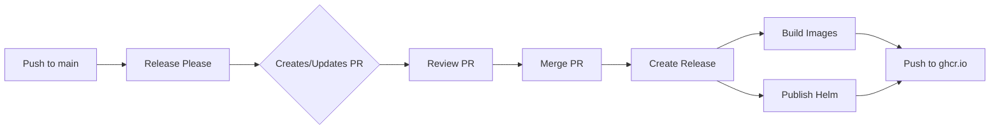

# Release Process

This document describes the release process for ThreeK8s, including automated releases via Release Please and manual release procedures.

## 🚀 Automated Releases (Recommended)

ThreeK8s uses [Release Please](https://github.com/googleapis/release-please) for automated semantic versioning and release management.

### How It Works

1. **Commit Convention**: Use [Conventional Commits](https://www.conventionalcommits.org/) format:
   ```
   feat: add new visualization mode
   fix: resolve WebSocket reconnection issue
   docs: update installation guide
   chore: update dependencies
   ```

2. **Automatic PR Creation**: Release Please monitors the `main` branch and creates/updates a PR with:
   - Version bumps based on commit types
   - Updated CHANGELOG.md
   - Updated package.json versions

3. **Release Trigger**: When the Release Please PR is merged:
   - Creates a GitHub release with tag
   - Triggers Docker image builds and publishing
   - Publishes Helm chart to OCI registry
   - Updates release notes with artifact information

### Commit Types and Version Bumps

| Commit Type | Version Bump | Example |
|------------|--------------|---------|
| `feat:` | Minor (0.X.0) | New features |
| `fix:` | Patch (0.0.X) | Bug fixes |
| `feat!:` or `BREAKING CHANGE:` | Major (X.0.0) | Breaking changes |
| `docs:`, `chore:`, `style:` | No bump | Documentation, maintenance |
| `perf:` | Patch | Performance improvements |

### Release Workflow



## 📦 Release Artifacts

Each release produces the following artifacts:

### Docker Images
- `ghcr.io/stianfro/threek8s/backend:<version>`
- `ghcr.io/stianfro/threek8s/frontend:<version>`
- Multi-architecture support (amd64, arm64)
- Automated vulnerability scanning
- Provenance and SBOM attestation

### Helm Chart
- `oci://ghcr.io/stianfro/threek8s/chart:<version>`
- Independent chart versioning
- OCI registry distribution
- Values schema validation

### GitHub Release
- Source code archives (zip, tar.gz)
- Release notes with changelog
- Deployment instructions
- Direct download links

## 🔧 Manual Release Process

If you need to create a release manually:

### 1. Update Versions

```bash
# Update version in root package.json
npm version <major|minor|patch>

# Update backend version
cd backend && npm version <major|minor|patch>

# Update frontend version
cd frontend && npm version <major|minor|patch>

# Update Helm chart version
# Edit helm/threek8s/Chart.yaml
# - version: X.Y.Z (chart version)
# - appVersion: X.Y.Z (application version)
```

### 2. Create Release Tag

```bash
# Create annotated tag
git tag -a v1.2.3 -m "Release v1.2.3"

# Push tag to trigger workflows
git push origin v1.2.3
```

### 3. Verify Release Workflows

Monitor GitHub Actions for:
- `Build Docker Images` workflow
- `Publish Docker Images` workflow
- `Publish Helm Chart` workflow

### 4. Test Released Artifacts

```bash
# Test Docker images
./tests/release/test-docker-images.sh

# Test Helm deployment
./tests/release/test-helm-deployment.sh

# Validate multi-arch manifests
./tests/release/validate-multi-arch.sh
```

## 🏷️ Version Management

### Application Versioning
- Follows [Semantic Versioning](https://semver.org/)
- Single version for entire application
- Synchronized across backend/frontend

### Helm Chart Versioning
- Independent from application version
- Chart version for Helm package changes
- App version references application release

Example:
```yaml
# Chart.yaml
version: 2.1.0      # Helm chart version
appVersion: "1.5.2" # Application version
```

## 🔄 Rollback Procedure

If a release has issues:

### Rollback Application

```bash
# Using Helm
helm rollback threek8s [REVISION]

# Using Docker
docker-compose down
docker-compose up -d --pull  # with previous version tags
```

### Rollback Release

```bash
# Delete the problematic release
gh release delete v1.2.3

# Delete the tag
git push --delete origin v1.2.3
git tag -d v1.2.3

# Fix issues and re-release
```

## 🧪 Pre-Release Testing

Before merging the Release Please PR:

### 1. Build Test

```bash
# Test Docker builds
npm run docker:build

# Test Helm chart
helm lint helm/threek8s/
helm install --dry-run threek8s helm/threek8s/
```

### 2. Integration Test

```bash
# Start with docker-compose
docker-compose up -d

# Run smoke tests
curl http://localhost:8080/api/health
curl http://localhost:3000

# Check logs
docker-compose logs
```

### 3. Kubernetes Test

```bash
# Deploy to test cluster
helm install test-release helm/threek8s/ \
  --namespace test \
  --create-namespace

# Verify deployment
kubectl get pods -n test
helm test test-release -n test

# Cleanup
helm uninstall test-release -n test
```

## 📋 Release Checklist

Before merging Release Please PR:

- [ ] All CI checks passing
- [ ] Docker builds successful
- [ ] Helm chart validates
- [ ] Integration tests pass
- [ ] Documentation updated
- [ ] Breaking changes documented
- [ ] Migration guide provided (if needed)

After release:

- [ ] Images published to ghcr.io
- [ ] Helm chart available in OCI registry
- [ ] GitHub release created with notes
- [ ] Announcement made (if major release)

## 🚨 Troubleshooting

### Release Please Not Creating PR

1. Check commit format:
   ```bash
   git log --oneline -10
   ```

2. Verify workflow runs:
   ```bash
   gh workflow view "Release Please"
   ```

3. Check branch protection rules

### Docker Build Failures

1. Test local build:
   ```bash
   docker build -t test backend/
   docker build -t test frontend/
   ```

2. Check multi-arch setup:
   ```bash
   docker buildx ls
   ```

### Helm Publishing Issues

1. Verify chart:
   ```bash
   helm package helm/threek8s/
   helm lint helm/threek8s/
   ```

2. Check registry access:
   ```bash
   helm registry login ghcr.io
   ```

## 📚 Resources

- [Release Please Documentation](https://github.com/googleapis/release-please)
- [Conventional Commits](https://www.conventionalcommits.org/)
- [Semantic Versioning](https://semver.org/)
- [GitHub Container Registry](https://docs.github.com/en/packages/working-with-a-github-packages-registry/working-with-the-container-registry)
- [Helm OCI Registry](https://helm.sh/docs/topics/registries/)

## 🤝 Contributing to Releases

1. Use conventional commit format for all commits
2. Include good commit messages that explain changes
3. Update documentation for new features
4. Add tests for bug fixes
5. Note breaking changes in commit body

Example commit:
```
feat: add namespace filtering to visualization

- Added dropdown to filter by Kubernetes namespace
- WebSocket now supports namespace-specific subscriptions
- Updated API to accept namespace parameter

BREAKING CHANGE: API endpoints now require namespace parameter
```

---

For questions about the release process, please open an issue or contact the maintainers.