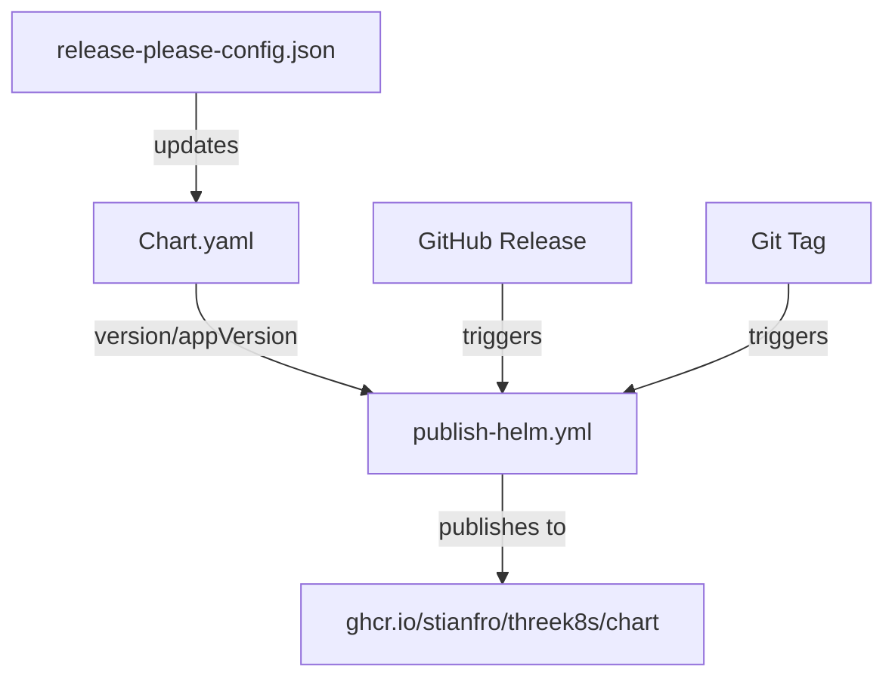

# Data Model: Helm Chart Configuration

## Configuration Entities

### 1. Release Please Configuration
**Entity**: ReleaseConfig
**Location**: `release-please-config.json`
```json
{
  "extra-files": [
    {
      "type": "yaml",
      "path": "helm/threek8s/Chart.yaml",
      "jsonpath": "$.version"
    },
    {
      "type": "yaml",
      "path": "helm/threek8s/Chart.yaml",
      "jsonpath": "$.appVersion"
    }
  ]
}
```
**Validations**:
- Chart.yaml path must exist
- JSONPath expressions must be valid
- Version fields must follow semver

### 2. Helm Chart Metadata
**Entity**: ChartMetadata
**Location**: `helm/threek8s/Chart.yaml`
```yaml
apiVersion: v2
name: threek8s
version: {semver}      # Managed by release-please
appVersion: {semver}   # Managed by release-please
```
**Validations**:
- Version must be valid semver (X.Y.Z)
- AppVersion must be valid semver
- Both synchronized by release-please

### 3. GitHub Workflow Configuration
**Entity**: PublishWorkflow
**Location**: `.github/workflows/publish-helm.yml`
```yaml
env:
  REGISTRY: ghcr.io
  CHART_NAME: chart  # Changed from "threek8s" to "chart"
  CHART_PATH: ./helm/threek8s
```
**OCI URLs**:
- Push: `oci://ghcr.io/stianfro/threek8s/chart`
- Pull: `oci://ghcr.io/stianfro/threek8s/chart`
**Validations**:
- All OCI URLs must be consistent
- Registry must be accessible
- Chart path must exist

## Configuration Relationships



## State Transitions

### Version Update Flow
1. **Commit** → Release Please detects changes
2. **PR Created** → Chart.yaml version bumped in PR
3. **PR Merged** → Release created with tag
4. **Tag Pushed** → Workflow triggered
5. **Chart Published** → Available at OCI registry

### Publication States
- **Pending**: Workflow not yet triggered
- **Building**: Linting and packaging chart
- **Publishing**: Pushing to OCI registry
- **Published**: Available for installation
- **Failed**: Error in any step

## Configuration Constraints

### Version Synchronization
- Chart version MUST match release version (minus 'v' prefix)
- AppVersion MUST match application version
- No manual version overrides in normal flow

### Registry Path Rules
- MUST use format: `ghcr.io/{owner}/{repo}/chart`
- NO double chart names (avoid `/threek8s/threek8s`)
- Consistent across push and pull operations

### Workflow Dependencies
- Requires GITHUB_TOKEN with packages:write permission
- Helm CLI version 3.8.0 or higher
- Registry login before push operations

## Migration Considerations

### From Old Path
- Old: `ghcr.io/stianfro/threek8s/threek8s`
- New: `ghcr.io/stianfro/threek8s/chart`
- No automated migration (old path broken)

### Documentation Updates
- README.md installation instructions
- RELEASING.md workflow documentation
- Release notes with new path